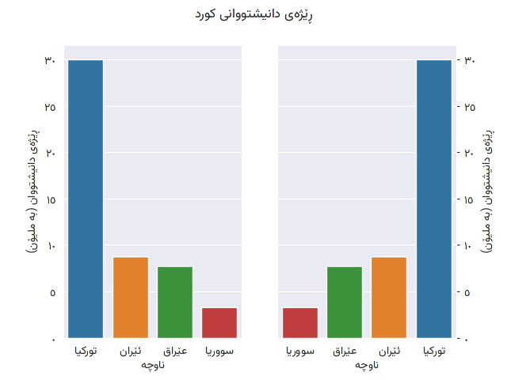

# Python and Pandas internationalisation

## Data visualisation issues for languages that need bidirectional support or complex font rendering.

_Matplotlib_ is a commonly used tool for basic data visualisation in Python, and is the default plotting tool with _pandas.Dataframe.plot_. It is also used by _seaborn_ and _wordcount_, along with other libraries and tools.

The default backends for _Matplotlib_ have a number of limitations:

1. No support for the Unicode bidirectional algorithm, 
2. No support for complex font rendering

This places severe limits on what natural languages can be used in titles, lables, legends, and other text elements in plots.

The package [mplcairo](https://github.com/matplotlib/mplcairo) provides an alternative backend for _matplotlib_ that uses [Raqm](https://github.com/HOST-Oman/libraqm) and [GNU FriBidi](https://github.com/fribidi/fribidi) for bidirectional text layout and complex rendering of OpenType features. This allows the use of most languages to be supported in plots.

The key limitations for _mplcairo_ are bugs in iPython and the lack of support for _Jupyter notebooks_.

Using the _mplcairo_ backend for _matplotlib_ we can display plot titles, axes labels and categorical tick labels in any language we need to support.

There are two missing pieces at this point:

1. Display of numeric tick labels in a numeral system approperiate for the UI language.
2. Choice on bidirectional layout requirements of the data visualisation.

### Numeral systems

Regarding the first issue, it is posisble to use `matplotlib.ticker.FuncFormatter()` to apply a function to convert to the target numeral system, and apply necessary grouping and decimal seperators.
### RTL layout and data visualisation

It isn't always necessary to change the layout of the plot. If the plot is using a cartesian coordinate system, it is best to use the default layout. 
The layout used, combinined with user expectations, will impact the interpretation of trends in data visualisations. User interpretation of the visualisations, combined with user experience are critical inputs into a data visualisation design.

If a RTL layout is required:

1. Use `yaxis.tick_right()` and `yaxis.set_label_position("right")` to reposition y-axis to the right side of the plot
2. Use `plt.gca().invert_xaxis()` to invert the x-axis. This step may not be necessary. UX is an important consideration.

### Examples

The following python scripts uses [Sorani Kurdish data](https://github.com/enabling-languages/python-i18n/blob/main/data/demographics.tsv):

* [matplotlib](https://github.com/enabling-languages/python-i18n/blob/main/py/matplotlib_kurdish.py)
* [pandas.Dataframe.plot](https://github.com/enabling-languages/python-i18n/blob/main/py/pandas_plot_kurdish.py)
* [seaborn](https://github.com/enabling-languages/python-i18n/blob/main/py/seaborn_kurdish.py)
* [wordcount](https://github.com/enabling-languages/python-i18n/blob/main/py/wordcloud_kurdish.py)

<figure style="border: 1px solid silver;"><figcaption align = "center" style="text-align: center"><b>Fig.1 - Kurdish bar charts in both LTR and RTL layouts.</b></figcaption></figure>
